# Investment CRM

A Microsoft Dynamics 365 / Power Platform portfolio project demonstrating business application development using Dataverse, C#, JavaScript, Power Automate, Power BI, PCF controls, Custom API, and role-based security.

---

## Overview

Investment CRM is a portfolio application that simulates an investment management system built on Microsoft Dynamics 365 and the Power Platform.

The solution demonstrates the complete lifecycle of developing a business application using Dataverse, client-side JavaScript, server-side plugins, Ribbon Workbench customization, Power Automate, Power BI, PCF controls, and Custom APIs.

Rather than focusing on isolated examples, the project follows a layered architecture and solution-based development approach inspired by real-world Dynamics 365 projects.

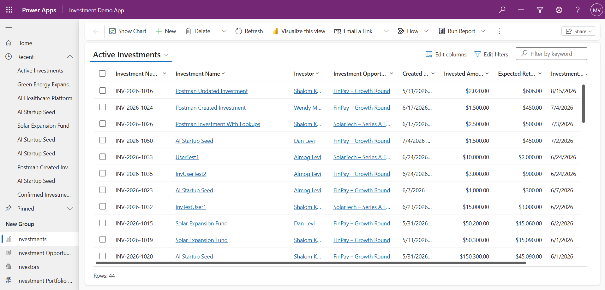

---

## Solution Highlights

The Investment CRM solution demonstrates the following Microsoft Dynamics 365 and Power Platform capabilities:

| Area | Implementation |
|------|----------------|
| **Dataverse** | Custom tables, relationships, rollup columns, calculated columns, forms and views |
| **Business Rules** | Validation, dynamic field requirements, and declarative business logic |
| **JavaScript** | Form events, calculations, client-side validation and notifications |
| **Plugins** | Layered C# plugin architecture with handlers, services and tracing |
| **Ribbon Workbench** | Custom command bar buttons for investment lifecycle management |
| **Power Automate** | Automated Excel data import into Dataverse |
| **Power BI** | Interactive dashboard for investment analytics |
| **Security** | Custom security roles and permission testing |
| **Custom API** | Server-side business logic exposed through a Dataverse Custom API |
| **PCF Control** | Custom Lifecycle Badge control for enhanced user experience |

# Business Scenario

Investment CRM is designed to simulate a real-world investment management solution built on Microsoft Dynamics 365 and the Power Platform.

The application enables investment managers to maintain investor records, manage investment opportunities, register investments, and monitor funding progress through a centralized business application.

The project demonstrates how different Power Platform components work together to deliver a complete business solution, combining client-side customization, server-side business logic, automation, reporting, and security.

 ## Architecture

The solution follows a layered architecture that separates data, client-side customization, server-side business logic, automation, and reporting into distinct components.

### Main Components

- **Dataverse** – Stores business data, relationships, forms, views, rollup columns, and calculated columns.
- **Client-side** – JavaScript, Business Rules, and Ribbon Workbench provide form validation, calculations, and user interactions.
- **Server-side** – C# plugins and Custom API implement business logic that runs within the Dataverse execution pipeline.
- **Power Platform** – Power Automate integrates external data into Dataverse, while Power BI provides reporting and analytics.
- **Testing** – Unit tests validate plugin business logic to improve maintainability and reliability.

## Dataverse

Dataverse serves as the foundation of the Investment CRM solution, storing business data, relationships, business logic, and user interface components.

The solution consists of three primary tables that represent the core business entities of the application.

### Investor

The **Investor** table stores information about individual investors and provides an overview of their investment portfolio.

Key functionality includes:

- Rollup column for total invested amount
- Portfolio summary generated through JavaScript
- Investment relationship and associated subgrid
- Custom views for different business scenarios

Active Investors view

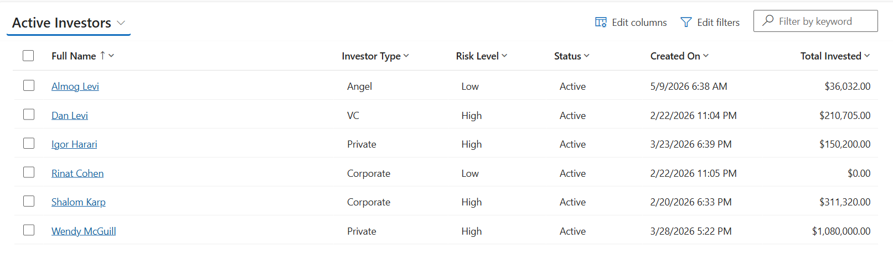

Investor record

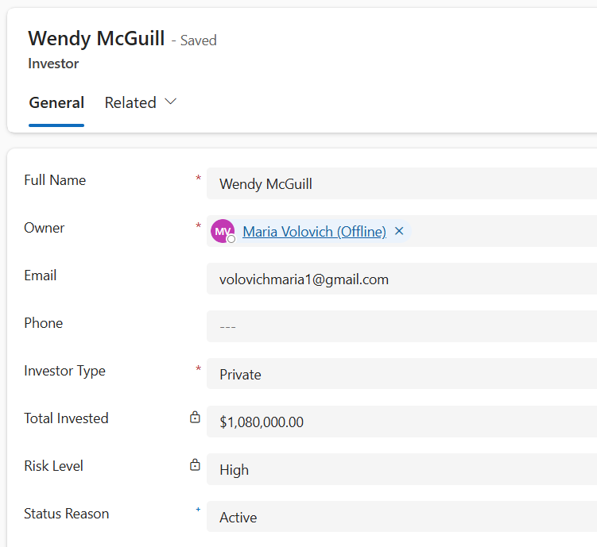

### Investment

The **Investment** table represents individual investments made by investors into investment opportunities.

Key functionality includes:

- Lookup relationships to Investor and Opportunity
- Investment lifecycle management
- Calculated expected return
- Business Rules for validation
- JavaScript calculations and notifications
- Plugin-driven business logic

Confirmed Investments view

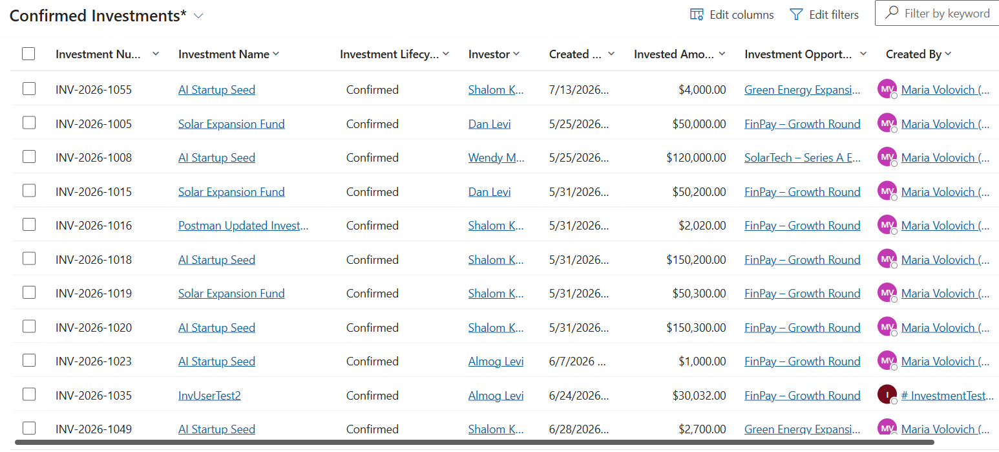

Investment record

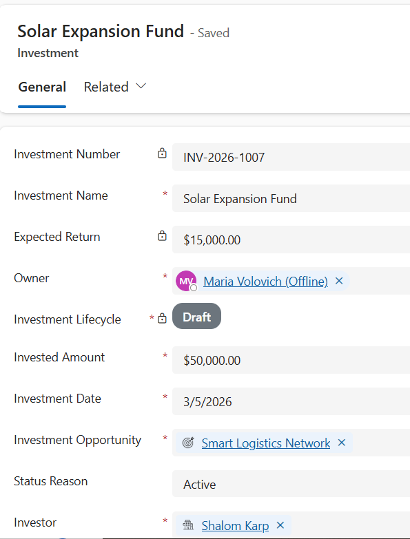

### Investment Opportunity

The **Investment Opportunity** table stores available investment opportunities and tracks funding progress.

Key functionality includes:

- Target investment amount
- Rollup of total raised funds
- ROI management
- Opportunity status tracking

Open opportunities view

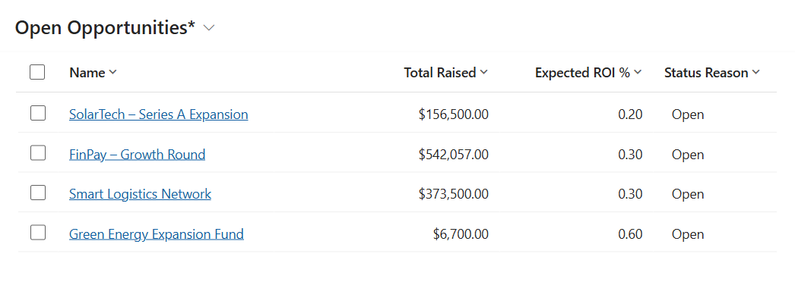

Investment opportunity record

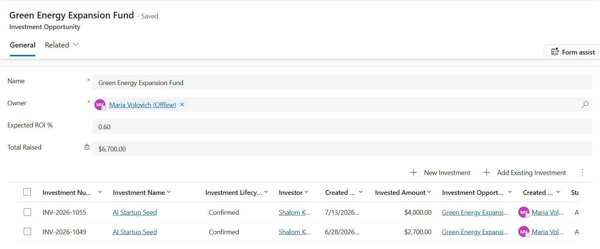

### Views

Custom views were created to simplify common business scenarios through filtered views such as Active Investors, Confirmed Investments, Open Opportunities, High Risk Investors, and Top Investors.

### Relationships

The solution models the following business relationships:

- One Investor can have multiple Investments.
- One Investment Opportunity can have multiple Investments.
- Each Investment belongs to a single Investor and a single Investment Opportunity.

## Client-Side Customization

Client-side functionality enhances the user experience by providing real-time validation, calculations, and business logic directly within Dynamics 365 forms.

### JavaScript

Custom JavaScript was implemented to enhance the user experience through client-side validation, calculations, notifications, and dynamic form behavior.

Key capabilities:

- Portfolio summary generation
- Investment amount calculations
- High Value Investment detection
- Future investment date validation
- Form notifications and user feedback
- Reusable JavaScript modules

Example:

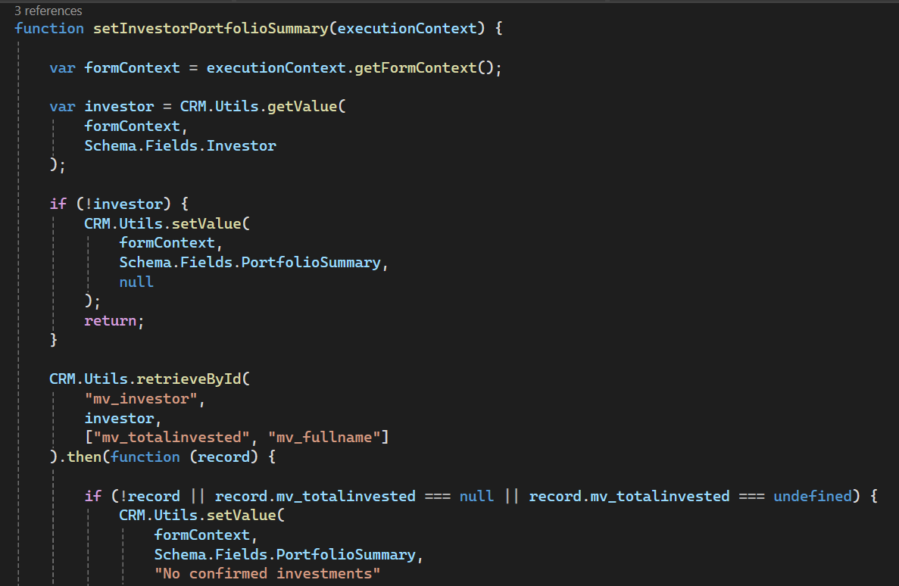

### Business Rules

Business Rules were used to implement declarative business logic without writing code where appropriate.

The implemented Business Rule:

- Requires an Investment Opportunity for high-value draft investments
- Dynamically removes the requirement when the condition is no longer met

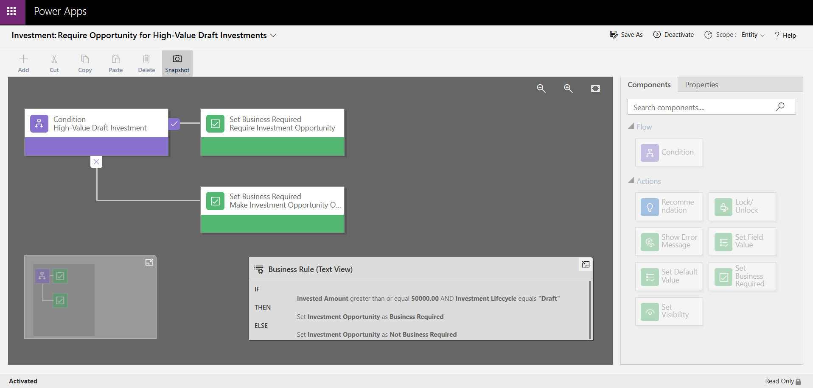

### Ribbon Workbench

Ribbon Workbench was used to extend the command bar with custom actions for managing the investment lifecycle.

Implemented commands:

- Confirm Investment
- Return to Draft

The commands are displayed conditionally based on the current investment lifecycle, ensuring users only see actions that are valid for the current record state.

These commands support the investment lifecycle and provide users with an explicit workflow for managing investment records.

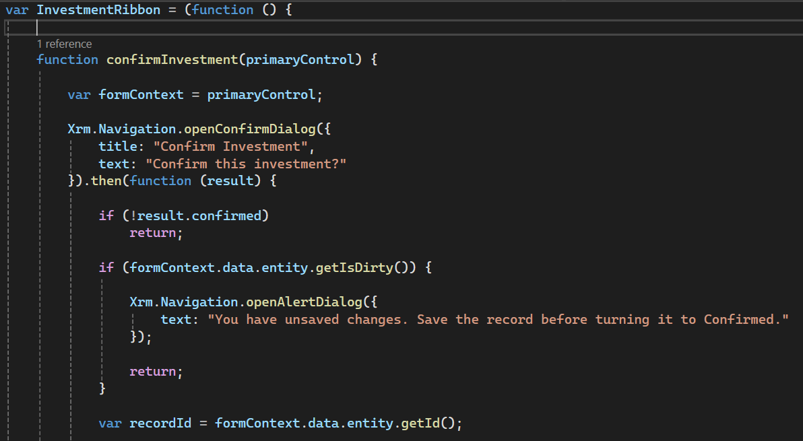

## Server-Side Development

Server-side business logic was implemented using C# plugins and a layered architecture to ensure maintainability, separation of concerns, and code reuse.

### Plugins

Plugins were registered on Dataverse events to execute business logic during record creation, updates, and deletion.

Key capabilities:

- Refreshing Dataverse rollup values
- Handling investor reassignment
- Maintaining data consistency
- Tracing and diagnostics for easier debugging

Plugin Registration Tool:

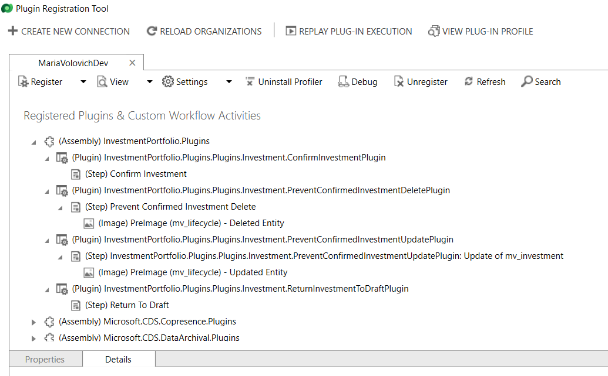

Plugin implementation:

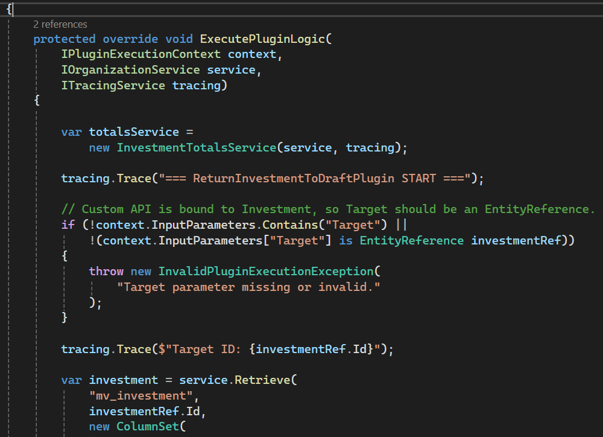

### Layered Architecture

Rather than placing all business logic directly inside plugin classes, the solution separates responsibilities into reusable components.

The implementation includes:

- Plugin entry points
- Handler classes
- Shared services
- Common helper classes

This approach improves readability, maintainability, and simplifies future extensions.

Example:

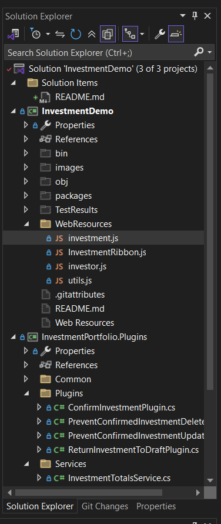

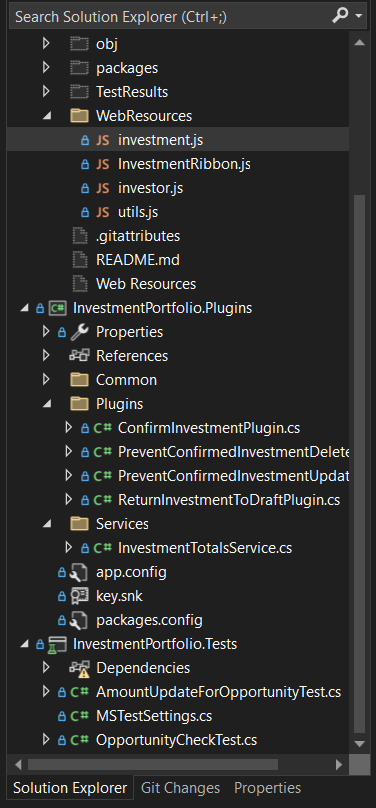

### Plugin Tracing & Diagnostics

Plugin tracing was implemented to simplify debugging and provide better visibility into plugin execution during development.

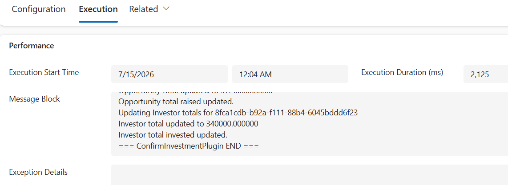

## Power Automate

Power Automate was used to automate data import, lifecycle maintenance, scheduled reminders, and investor notifications.

The flows demonstrate integration between Dataverse, Excel, OneDrive, SharePoint, and Outlook.

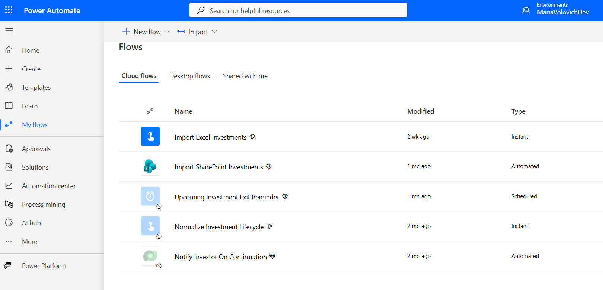

| Flow | Type | Purpose |
|------|------|---------|
| **Import Excel Investments** | Instant | Manually imports investment records from an Excel file stored in OneDrive into Dataverse. |
| **Import SharePoint Investments** | Automated | Creates investment records when an Excel file is added to a SharePoint location. |
| **Upcoming Investment Exit Reminder** | Scheduled | Checks investments approaching their exit date and sends reminder emails with generated CSV attachment data. |
| **Normalize Investment Lifecycle** | Instant | Finds investments with an empty lifecycle value and sets them to Draft. |
| **Notify Investor On Confirmation** | Automated | Sends a confirmation email to the investor when an investment is confirmed, including investor, opportunity, amount, and expected return details. |

These flows demonstrate how Power Automate can be used both for user-triggered actions and background automation around Dataverse data.

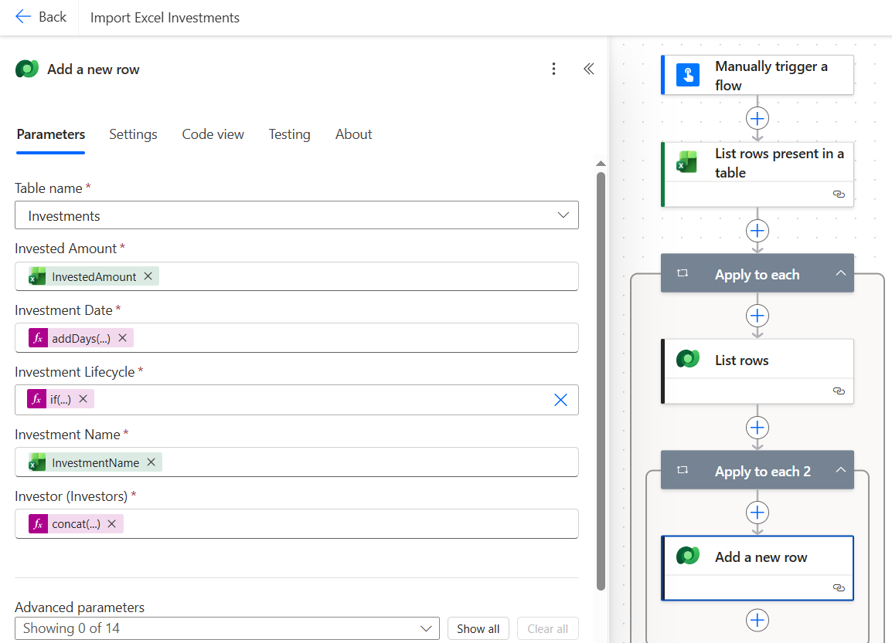

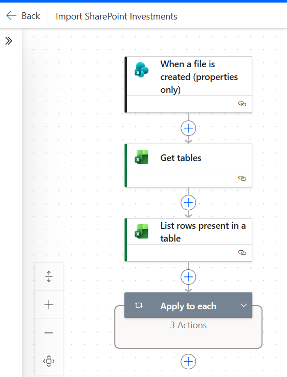

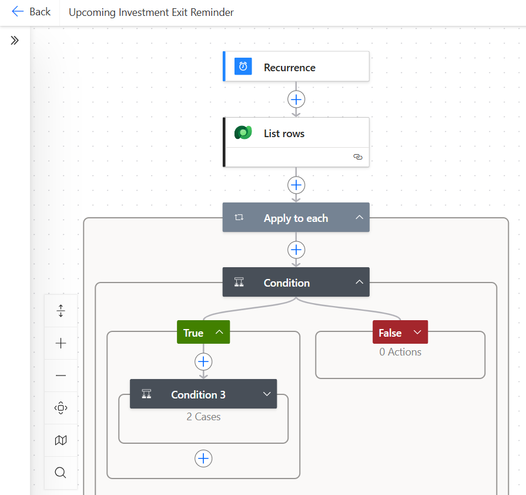

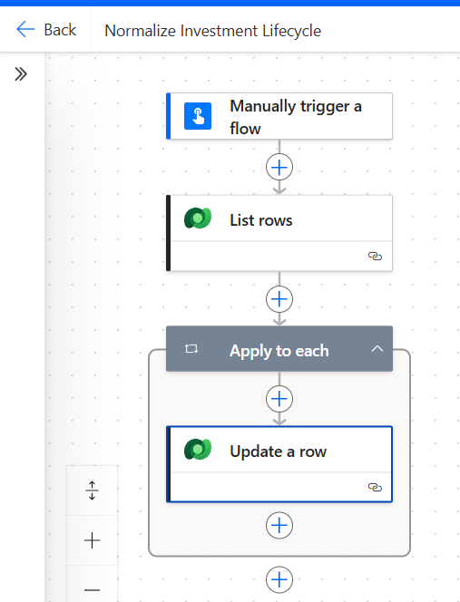

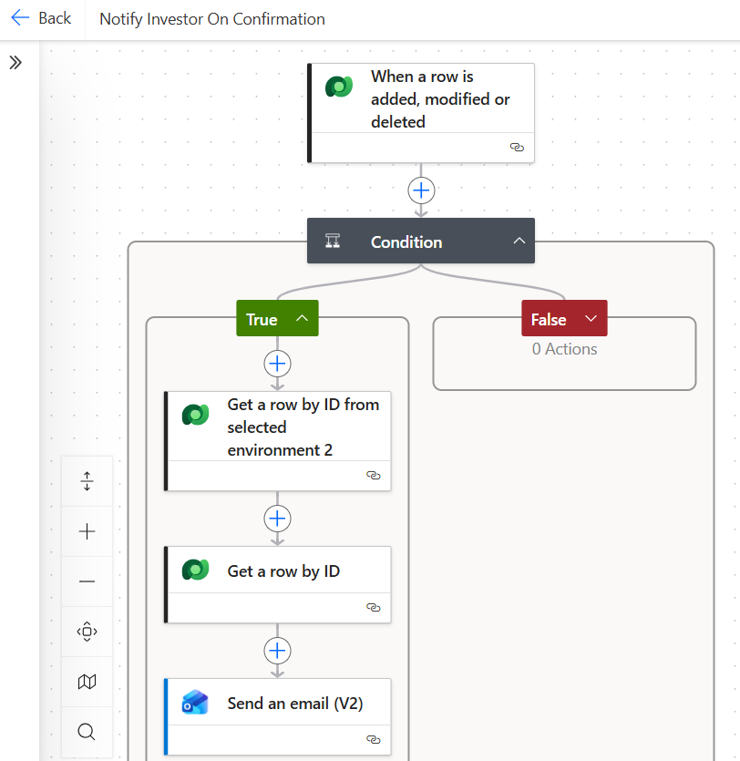

## Power BI

Power BI was used to provide interactive reporting and analytics for the Investment CRM solution.

The dashboard provides a high-level overview of portfolio performance, investment lifecycle distribution, and investor activity.

Implemented reporting includes:

- Investment amount analysis
- Investment lifecycle distribution
- Investor and opportunity-related insights
- Interactive business dashboard

Power BI demonstrates how Dataverse data can be transformed into meaningful business insights for decision-making.

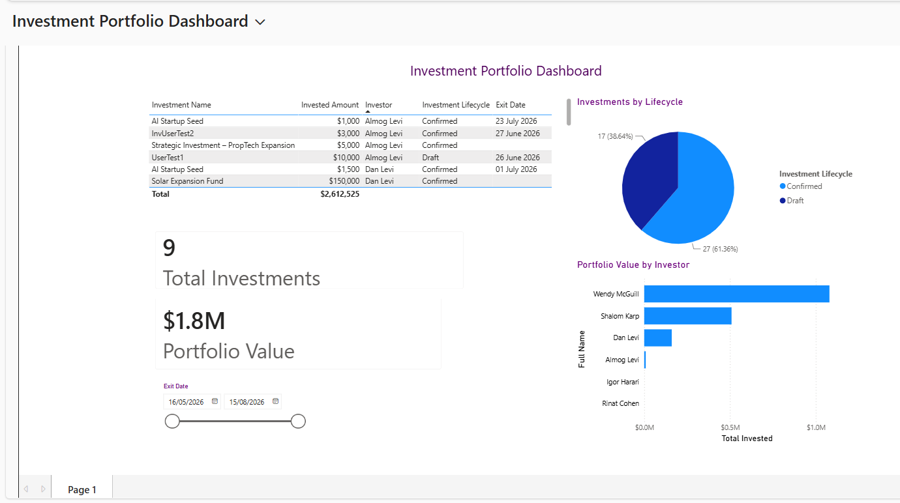

## Security

Role-based security was implemented and validated using a dedicated test user to demonstrate controlled access to Dataverse data.

### Security Roles

A custom **Investment Manager** security role was created with permissions tailored to investment management activities.

Key capabilities include:

- Creating and updating investment records
- Reading investment data across the organization
- Controlled delete permissions
- Organization-level Append and Append To permissions
- Business Unit write permissions where appropriate

Example:

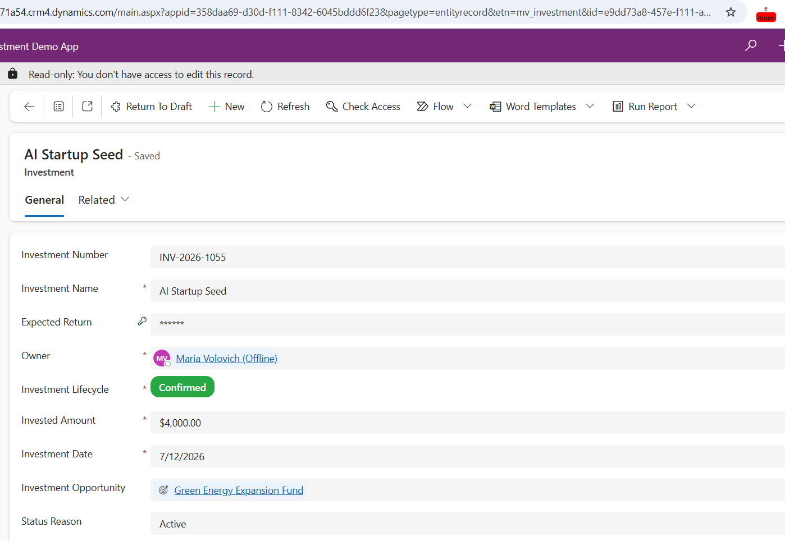

### Security Testing

Permissions were validated using a dedicated **InvestmentTester** account assigned the **Basic User** and **Investment Manager** security roles. The role was tested through real application scenarios to verify that users could perform intended operations while restricted functionality remained inaccessible.

Testing included:

- Record creation
- Record updates
- Delete restrictions
- Append / Append To permissions
- Field-level security validation

### Column Security

The **Expected Return** column is protected using Dataverse Column Security.

As shown in the screenshot above, users without the required permissions can access the investment record but cannot view the protected financial value, demonstrating field-level security independent of record access.

## Custom API

The solution includes a custom Dataverse API that demonstrates how business functionality can be exposed through reusable server-side endpoints.

The Custom API extends the standard Dataverse capabilities by allowing custom business logic to be executed through the Dataverse Web API.

Example:

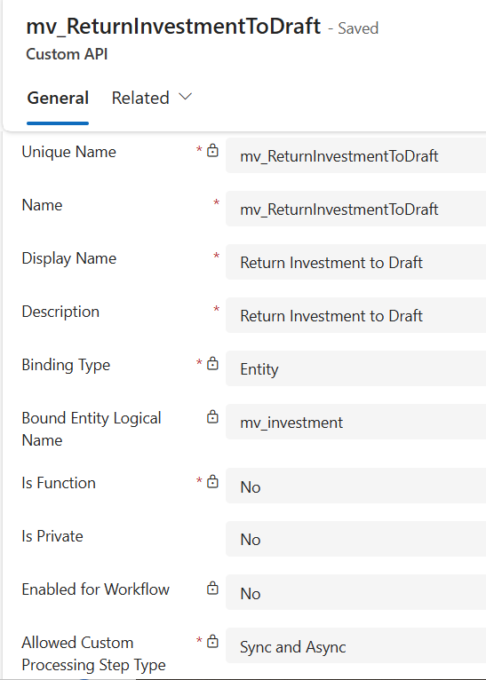

### Implementation

The Custom API was implemented using C# and registered within Dataverse as a solution component.

Key implementation aspects:

- Custom server-side business logic
- Dataverse API extensibility
- Secure execution within the Dataverse pipeline
- Reusable business operations

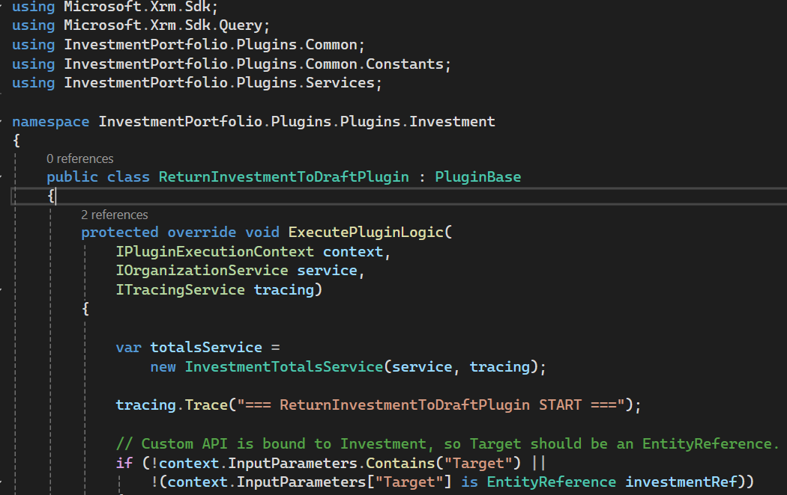

### API Testing

The Custom API was validated using Postman to simulate external client requests and verify successful execution through the Dataverse Web API.

This demonstrates how custom Dataverse business logic can be consumed independently of the Dynamics 365 user interface by external applications through the Dataverse Web API.

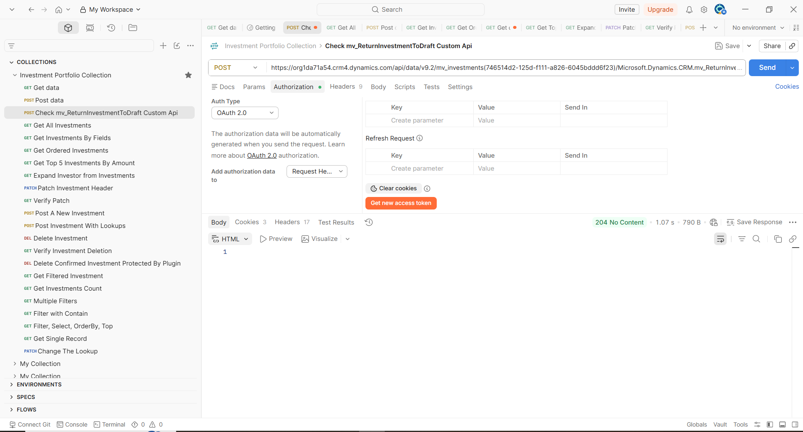

## PCF Control

The solution includes a custom **PowerApps Component Framework (PCF)** control that replaces the standard Investment Lifecycle choice field with a visual status badge.

Instead of displaying a standard option set, the control presents the current investment status using color-coded labels, improving readability and user experience.

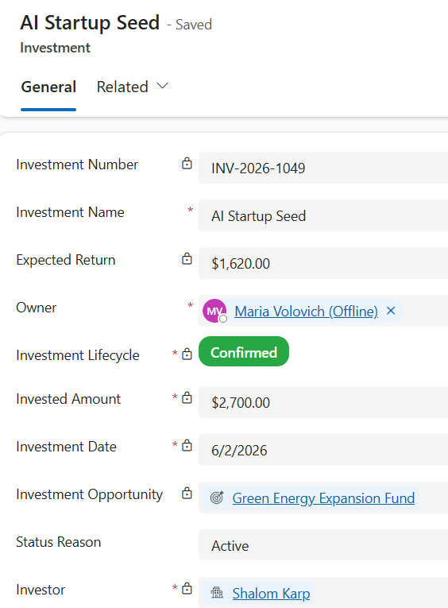

The custom control replaces the default option set with a cleaner visual representation while preserving the underlying Dataverse field value.

### Features

- Custom PowerApps Component Framework control
- Visual lifecycle indicator
- Displays Draft and Confirmed statuses
- Reads lifecycle values through the PCF context
- Fully integrated into the Investment form

The control demonstrates how the standard Dynamics 365 user interface can be extended with reusable components built using TypeScript and the Power Apps Component Framework.

## Architecture & Design Decisions

Throughout the project, several architectural decisions were made to improve maintainability, readability, and the overall user experience.

### Draft / Confirmed Investment Lifecycle

One of the most significant architectural decisions during development was introducing an explicit investment lifecycle.

Instead of relying on multiple automatic plugin operations, investments now progress through **Draft** and **Confirmed** states using dedicated Ribbon commands.

Users explicitly control when an investment moves between **Draft** and **Confirmed** using dedicated Ribbon commands.

This approach:

- Provides a clear investment lifecycle
- Prevents incomplete investments from affecting reporting
- Reduces unnecessary automation
- Makes application behavior more predictable

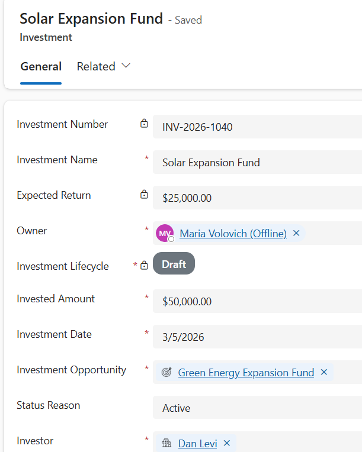

---

### Layered Plugin Architecture

Rather than placing all business logic directly inside plugin classes, responsibilities were separated into plugins, shared infrastructure, services, and reusable helper components.

Benefits of this approach:

- Maintainability
- Code reuse
- Readability
- Future extensibility

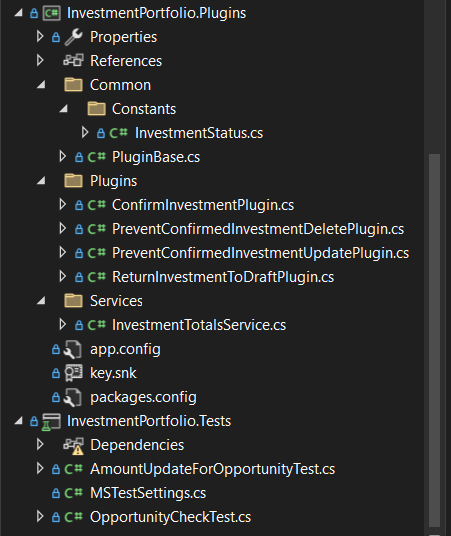

---

### Choosing the Right Tool

The solution intentionally uses different Power Platform technologies depending on the business requirement.

| Requirement | Technology |
|-------------|------------|
| Immediate user feedback | JavaScript |
| Declarative business logic | Business Rules |
| Server-side validation | Plugins |
| Data aggregation | Rollup Columns |
| Business workflow | Ribbon Workbench |
| Integration | Power Automate |
| Reporting | Power BI |
| UI customization | PCF |
| External business operations | Custom API |

This approach demonstrates how different Microsoft Power Platform technologies complement each other within a single business application.

---

### Confirmed Business Data

Only **Confirmed** investments are included in business-facing views, dashboards, and related subgrids.

This ensures that **Draft** records do not affect portfolio summaries, opportunity funding calculations, dashboards, or business reporting until they are **Confirmed**.

The project evolved considerably during development. Several initial implementations were intentionally redesigned as new requirements emerged and simpler architectural approaches were identified.

This iterative process helped improve both the technical design and the overall user experience while providing valuable experience in evaluating architectural trade-offs.

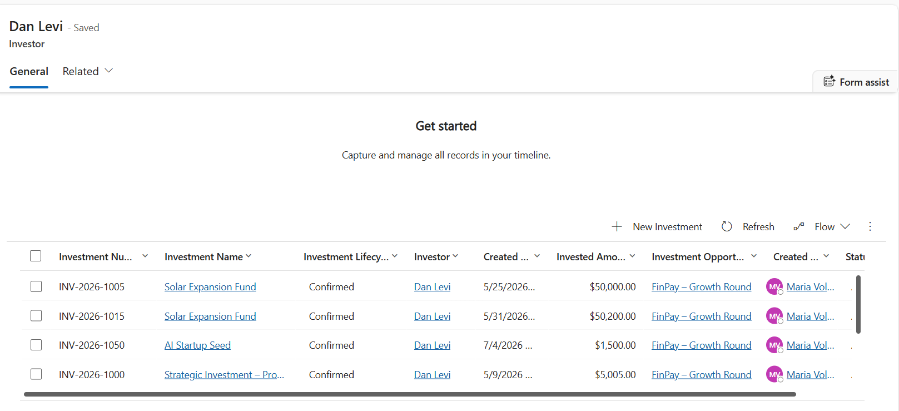

## Testing

The solution includes unit tests that validate server-side business logic while demonstrating a testable plugin architecture.

Testing was implemented using **FakeXrmEasy**, allowing plugin behavior to be verified without requiring a live Dataverse environment.

Although the current test suite focuses on core business scenarios, it establishes a foundation that can be expanded as the solution evolves.

Testing highlights include:

- Validation of plugin business logic
- Verification of server-side behavior
- Isolated test execution
- Maintainable testing approach

The testing approach reflects the project's emphasis on maintainable, reliable server-side development rather than solely focusing on feature implementation.

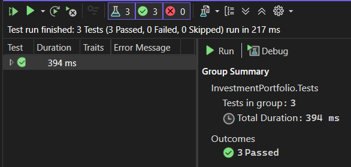

## Source Control

The project was developed using Git with a feature-based workflow to simulate collaborative software development.

Development practices included:

- Feature branches
- Pull Requests
- Incremental commits
- Descriptive commit history

This workflow demonstrates common version control practices while maintaining a clean and well-organized repository.

## Repository Structure

The repository is organized into logical components to separate different areas of the solution.

- **Plugins** – Server-side business logic, shared infrastructure, services, and plugin implementations.
- **Tests** – Unit tests validating server-side functionality using FakeXrmEasy.
- **PCF** – PowerApps Component Framework control implementing the custom Lifecycle Badge.
- **WebResources** – Client-side JavaScript libraries and Ribbon command scripts.
- **Power Automate** – Cloud flows supporting data import, notifications, and scheduled business processes.
- **Power BI** – Dashboard and reporting assets used for investment analytics.
- **README** – Project documentation describing the architecture, implementation, and design decisions.

## Installation

To explore the solution:

1. Import the managed/unmanaged solution.
2. Publish all customizations.
3. Configure Power Automate connections.
4. Import the Power BI report (optional).
5. Assign the appropriate security roles.

## Technical Highlights

This project demonstrates practical experience with:

- Microsoft Dataverse
- C# Plugins
- JavaScript Form Scripting
- Ribbon Workbench
- Business Rules
- Power Automate
- Power BI
- PowerApps Component Framework (PCF)
- Dataverse Custom API
- Column Security
- Security Roles
- FakeXrmEasy Unit Testing
- Git Workflow
- Postman API Testing

## Acknowledgements

Building this project was both a software engineering exercise and a learning journey. Throughout its development I used AI-assisted discussions to brainstorm architecture, review code, challenge design decisions, and improve documentation. All implementation, testing, and final technical decisions were completed and validated by me.

Building this project provided an opportunity to deepen my understanding of Microsoft Dynamics 365 and the Power Platform through practical implementation, continuous iteration, and architectural refinement.

The project reflects the technical skills developed throughout its implementation, along with the experience gained from designing, refining, and documenting a complete business application.

This portfolio represents a practical end-to-end Dynamics 365 solution demonstrating client-side customization, server-side development, automation, security, reporting, and software engineering practices within the Microsoft Power Platform ecosystem.